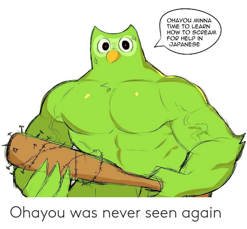

# BALLS



ik;eeeeeeeej;kshjklhsdoihgfowiehfbnslkjdf'ougsdhf;jkhsdjhfsgouerhg;iudgjk

**hsdgfuwegf**
*ndbjfne*
***jdhfbiwjhdf***

###### suck it

- bum
- balls
- lemons
- seabiscuit
- resberry

###to do
  1. take a melon to the face
  1. don't die
  
> on installing.. packages?

  2. how about no
  2. im teaching myself better
  2. i like you
  2. but this is not helping

 you can fetch images and urls and put them in this thing. you can also resize stuff. 
```

# hey look ma. i'm (not) writing html


*apparently i could write my thesis in here*

[Download R](http://www.r-project.org/)    
[RStudio](http://www.rstudio.com/)

beep boop table goop

beep  | boop
------|-------
ha    | Ha
ha    | ha

```{r setup, include=FALSE}
knitr::opts_chunk$set(echo = TRUE)
```

## R Markdown

This is an R Markdown document. Markdown is a simple formatting syntax for authoring HTML, PDF, and MS Word documents. For more details on using R Markdown see <http://rmarkdown.rstudio.com>.

When you click the **Knit** button a document will be generated that includes both content as well as the output of any embedded R code chunks within the document. You can embed an R code chunk like this:

```{r cars}
summary(cars)
```

## Including Plots

You can also embed plots, for example:
```

# "plot" **wink**
```{r}
library(ggplot2)
summary(iris)

butt <- ggplot(iris, aes(x = Sepal.Length, y = Sepal.Width, colour = Species)) + geom_boxplot()

butt

```


```{r pressure, echo=FALSE}
plot(pressure)
```

Note that the `echo = FALSE` parameter was added to the code chunk to prevent printing of the R code that generated the plot.
